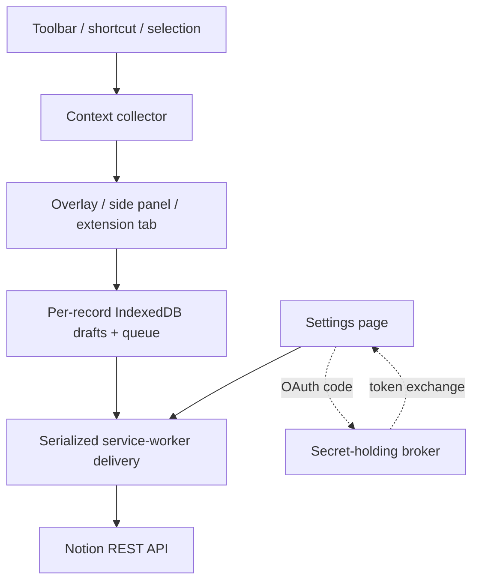

# Notion Quick Note

A Notion-styled Chrome extension for saving a thought without leaving the webpage you're viewing, using the fast invocation model popularized by Apple Quick Note. See [`DESIGN.md`](DESIGN.md) for the visual system.

Open it from the toolbar, press `Ctrl + Shift + Space`, or right-click selected text. The floating Notion-style page keeps a structured local draft, optionally includes the source page, and sends native blocks to either a running Notion page or a database.

## What works

- Floating bottom-right composer isolated from the host webpage with Shadow DOM, with automatic side-panel and extension-tab fallbacks
- Toolbar, keyboard shortcut, and selected-text context menu entry points
- Locally bundled Tiptap block editor with Markdown input rules, slash commands, and a selection toolbar
- One versioned active draft across regular Chrome tabs, with explicit cross-tab handoff, stale-revision protection, and separately isolated Incognito state
- A local Recent picker for the last 30 days, with five-note quick access, search, stashed-draft return, and live editing of supported Notion content
- Multi-page source management with normalized URL deduplication, a stable primary source, selection quotes, and a 20-source cap
- Durable local delivery queue with serialized retries, restart recovery, toolbar badges, and a 30-day Notes view
- Storage diagnostics plus full-fidelity JSON and readable Markdown recovery exports
- Session-only, separately namespaced Incognito captures via Chrome's split Incognito mode
- Append-to-page and one-note-per-database-item modes
- Current page title/link and formatted quote capture
- Light and dark mode, reduced-motion support, focus containment, and keyboard save/close
- Guided connect → destination → ready onboarding
- Crash-safe private Quick Notes database creation with source metadata, Capture ID deduplication, and a searchable destination picker fallback
- Personal access token setup tucked under Advanced setup for local testing
- Production OAuth with allowlisted exchange, refresh, and revocation broker routes
- Native Notion block output for headings, lists, to-dos, quotes, toggles, code, dividers, formatting, and links
- Conflict-safe Notion updates with locked placeholders for unsupported blocks and a resumable insert-before-archive journal
- No remote runtime code; the editor is bundled locally for Chrome MV3

## Try it locally

1. Clone or download the repository.
2. Run `npm install` and `npm run build`.
3. Open `chrome://extensions`, enable **Developer mode**, and choose **Load unpacked**.
4. Select this repository folder.
5. Open the extension's **Details → Extension options**.
6. Open **Advanced setup**, create a personal access token in Notion's [developer portal](https://www.notion.so/profile/integrations/internal), and paste it into settings.
7. Quick Note will create a private **Quick Notes** database automatically. If Notion cannot complete setup, retry recovery or choose a shared page or database from the destination picker.
8. On a normal webpage, click the extension icon or press `Ctrl + Shift + Space`.

After rebuilding an already loaded unpacked extension, click **Reload** for Notion Quick Note on `chrome://extensions` before testing. Chrome otherwise keeps the previous service worker alive, which can continue referencing an older content-script path.

Inside the editor, type `/` for block commands. Markdown shortcuts such as `# `, `- `, `[] `, `> `, and triple backticks convert as you type. Press `Ctrl/⌘ + Enter` to check a to-do or open/close a toggle, `Ctrl/⌘ + Shift + Enter` to save, and `Escape` to close.

Opening Quick Note explicitly on another tab moves the same regular-profile draft there and adds that page to Sources. Use **Recent** to reopen one of the latest five notes or search retained local history. The current draft is stashed while a recent note is edited and returns after that edit is saved or discarded.

Personal tokens act as the user who created them. Treat the token as a password and use this setup only for your own local build. A Chrome Web Store release should use the included OAuth path.

## Destinations

### Running page

Each capture appends a small Notion section containing a title, source link, note or selection, timestamp, and divider. This is the simplest and most Apple Notes–like inbox.

### Database

Each capture creates a new item. Set **Database title property** to the exact name of the database's title column (usually `Name`). You can paste a database URL; the extension resolves the database's first data source using Notion's current API.

Automatically managed databases use schema v3 with `Name`, `Capture ID`, `Source URL`, `Source Domain`, and Notion's read-only `Captured At` timestamp. `Capture ID` lets the worker check a timed-out or interrupted delivery before retrying, preventing duplicate pages. Quick Note records stable property IDs, so later renames keep working. Manually selected databases and page-appends are never migrated; ambiguous deliveries stop for review instead of risking a duplicate.

Provisioning state is written before the database request. If Chrome closes or a response is lost, Quick Note searches for the exact managed marker and compatible schema before it creates anything else, preventing an uncertain request from being retried blindly.

## Production OAuth

Notion's public connection flow exchanges and refreshes tokens using a client ID and client secret. The secret must not ship in a browser extension, so `oauth-worker/` contains a small allowlisted broker for exchange, refresh, and revocation.

1. Create a public Notion connection and copy its client ID and secret.
2. Load the unpacked extension once and copy its extension ID from `chrome://extensions`.
3. In the settings page console, run `chrome.identity.getRedirectURL('notion')` and add the result to the connection's redirect URIs.
4. Copy `oauth-worker/wrangler.toml.example` to `oauth-worker/wrangler.toml` and fill in the extension ID/origin allowlists.
5. Add the worker secrets with `wrangler secret put NOTION_CLIENT_ID` and `wrangler secret put NOTION_CLIENT_SECRET`, then deploy it.
6. For local testing, set the public client ID and deployed broker URL in `src/product-config.js`, reload the extension, then choose **Connect Notion**.

For a Web Store build, keep production values out of the development source and follow the deterministic packaging workflow in [`docs/RELEASE.md`](docs/RELEASE.md). Reserve the production extension ID, register its exact `chromiumapp.org` redirect in Notion, and exercise exchange/refresh/revocation against the deployed broker before packaging.

## Architecture



The composer never receives the stored Notion token or accesses extension storage directly. Validated messages cross into the service worker, where each regular draft and capture is stored as its own IndexedDB record and Save atomically replaces a draft with a durable queue record. A small `chrome.storage.local` index holds only summary metadata. The composer waits for confirmed Notion delivery; after ten seconds it offers a safe close while the recoverable background queue continues independently.

## Why this shape

Chrome's [Side Panel API](https://developer.chrome.com/docs/extensions/reference/api/sidePanel) is persistent across tabs and is a strong future fallback, but it is browser-owned and visually heavier than Apple Quick Note. A content-script card is closer to the requested bottom-right interaction. Chrome documents that [content scripts run in an isolated world](https://developer.chrome.com/docs/extensions/develop/concepts/content-scripts), making this a practical way to add an overlay without sharing JavaScript state with the host page.

Flylighter validates the fast-capture demand. Its public listing emphasizes flows, database properties, formatted highlights, append-to-existing-capture, instant capture, and shortcuts. This MVP borrows the speed and source-capture principles without copying its power-user configuration surface.

Notion supports [appending blocks to a page](https://developers.notion.com/reference/patch-block-children) and [creating pages under a data source](https://developers.notion.com/reference/post-page). For distribution to other users, Notion's [authorization guide](https://developers.notion.com/guides/get-started/authorization) requires a public OAuth connection; Chrome's [`launchWebAuthFlow`](https://developer.chrome.com/docs/extensions/reference/api/identity#method-launchWebAuthFlow) provides the extension-side browser flow.

## Product roadmap

### Milestone 1 — dependable personal capture (this repository)

- Fast note, selection, and source capture
- Page and database destinations
- Local drafts and clear save feedback
- Manual-token testing and production OAuth scaffold

### Milestone 2 — make capture feel intelligent

- Additional destination filters and recent-destination ranking
- Database schema discovery and property mapping
- `#tag` and `@destination` parsing in the composer
- Image and screenshot attachments
- Destination commands and richer capture routing
- Optional OS-level sharing entry points
- Richer recent-note filters and destination-aware ranking

### Milestone 3 — a true personal capture layer

- Reusable capture flows inspired by Flylighter
- Append a new highlight to an earlier note
- Workspace-wide or opt-in remote search beyond retained local captures
- Multiple providers behind one destination adapter
- Safari/WebExtension packaging and mobile share-sheet companion

## Development

```sh
npm install
npm run build
npm run dev
npm test
npm run check
```

`npm run dev` watches the editor source and regenerates `dist/content.js`. `npm run check` builds the MV3 bundle, checks extension scripts, runs Node unit/design tests, and exercises the editor in real Chromium with Playwright.

`npm run release:package` first requires that full check to pass, then creates an allowlisted Chrome Web Store ZIP with production OAuth configuration and an exact broker-origin permission. See the [release runbook](docs/RELEASE.md) and [store listing draft](docs/STORE_LISTING.md).

## Privacy posture

- Requests are limited to Notion's API and an optional user-configured OAuth broker.
- The extension asks for `activeTab`, not permanent read access to every page.
- Page content is read only after a toolbar/shortcut/context-menu gesture.
- Regular drafts, queued captures, and delivery history use per-record IndexedDB storage; only a small capture index and settings remain in trusted `chrome.storage.local`.
- Incognito capture data uses one `chrome.storage.session` key per record and disappears with that Incognito session.
- Notes can report local storage use and export capture-only recovery files as JSON or Markdown; credentials and settings are excluded.
- Pending, blocked, and uncertain captures are never purged automatically; delivered history and abandoned drafts use bounded 30-day retention.
- No analytics, trackers, or remote scripts are included.

The complete data handling and retention statement is in [`PRIVACY.md`](PRIVACY.md). A release must publish that policy at a stable HTTPS URL after replacing its support-contact placeholder.

See [docs/PRODUCT.md](docs/PRODUCT.md) for the research summary and product decisions.

For an illustrated explanation of the architecture, capture lifecycle, core primitives, edit map, competitive position, maintenance process, and roadmap, read the [visual operating guide](docs/VISUAL_GUIDE.md).
