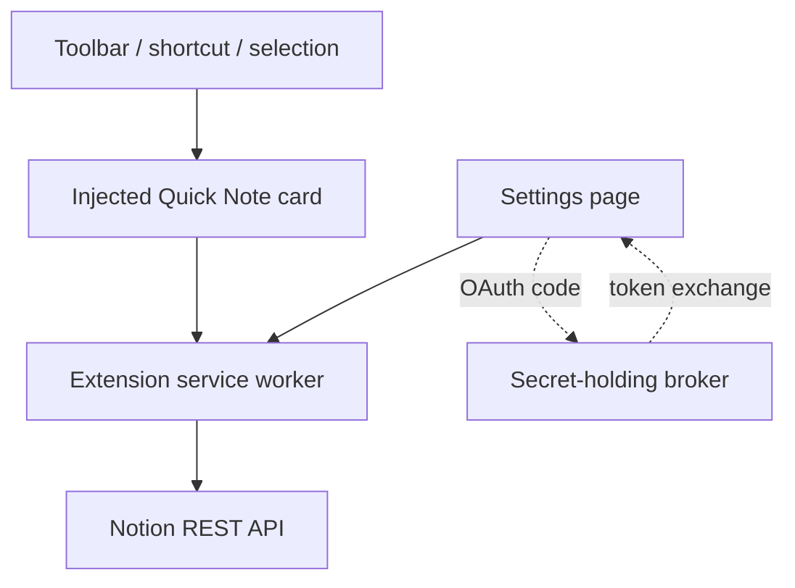

# Notion Quick Note

An Apple Quick Note–inspired Chrome extension for saving a thought to Notion without leaving the webpage you're viewing.

Open it from the toolbar, press `Ctrl + Shift + Space`, or right-click selected text. The floating card keeps a local draft, optionally includes the source page, and sends the capture to either a running Notion page or a database.

## What works

- Floating bottom-right composer isolated from the host webpage with Shadow DOM
- Toolbar, keyboard shortcut, and selected-text context menu entry points
- Automatic per-page drafts in `chrome.storage.session`
- Append-to-page and one-note-per-database-item modes
- Current page title/link and formatted quote capture
- Light and dark mode, reduced-motion support, and keyboard save/close
- Personal access token onboarding for local testing
- Production OAuth UI plus an allowlisted Cloudflare Worker broker scaffold
- No build tool or runtime dependencies; load the folder directly into Chrome

## Try it locally

1. Clone or download the repository.
2. Open `chrome://extensions`, enable **Developer mode**, and choose **Load unpacked**.
3. Select this repository folder.
4. Open the extension's **Details → Extension options**.
5. In Notion's [developer portal](https://www.notion.so/profile/integrations/internal), create a personal access token and paste it into settings.
6. Paste the URL of the Notion page you want to use as your inbox, choose **Append to a page**, and save.
7. On a normal webpage, click the extension icon or press `Ctrl + Shift + Space`.

Personal tokens act as the user who created them. Treat the token as a password and use this setup only for your own local build. A Chrome Web Store release should use the included OAuth path.

## Destinations

### Running page

Each capture appends a small Notion section containing a title, source link, note or selection, timestamp, and divider. This is the simplest and most Apple Notes–like inbox.

### Database

Each capture creates a new item. Set **Database title property** to the exact name of the database's title column (usually `Name`). You can paste a database URL; the extension resolves the database's first data source using Notion's current API.

## Production OAuth

Notion's public connection flow exchanges the authorization code using a client ID and client secret. The secret must not ship in a browser extension, so `oauth-worker/` contains a minimal exchange broker.

1. Create a public Notion connection and copy its client ID and secret.
2. Load the unpacked extension once and copy its extension ID from `chrome://extensions`.
3. In the settings page console, run `chrome.identity.getRedirectURL('notion')` and add the result to the connection's redirect URIs.
4. Copy `oauth-worker/wrangler.toml.example` to `oauth-worker/wrangler.toml` and fill in the extension ID/origin allowlists.
5. Add the worker secrets with `wrangler secret put NOTION_CLIENT_ID` and `wrangler secret put NOTION_CLIENT_SECRET`, then deploy it.
6. In extension settings, select **Notion OAuth**, enter the public client ID and deployed broker URL, then connect.

Before a public launch, add refresh-token rotation to the broker, fix the production extension ID with a manifest key or Web Store listing, and complete Notion's public connection review.

## Architecture



The injected card never receives the stored Notion token. It passes capture data to the service worker, which owns API access. The card uses Shadow DOM so site styles and scripts do not alter its UI.

## Why this shape

Chrome's [Side Panel API](https://developer.chrome.com/docs/extensions/reference/api/sidePanel) is persistent across tabs and is a strong future fallback, but it is browser-owned and visually heavier than Apple Quick Note. A content-script card is closer to the requested bottom-right interaction. Chrome documents that [content scripts run in an isolated world](https://developer.chrome.com/docs/extensions/develop/concepts/content-scripts), making this a practical way to add an overlay without sharing JavaScript state with the host page.

Flylighter validates the fast-capture demand. Its public listing emphasizes flows, database properties, formatted highlights, append-to-existing-capture, instant capture, and shortcuts. This MVP borrows the speed and source-capture principles without copying its power-user configuration surface.

Notion supports [appending blocks to a page](https://developers.notion.com/reference/patch-block-children) and [creating pages under a data source](https://developers.notion.com/reference/post-page). For distribution to other users, Notion's [authorization guide](https://developers.notion.com/guides/get-started/authorization) requires a public OAuth connection; Chrome's [`launchWebAuthFlow`](https://developer.chrome.com/docs/extensions/reference/api/identity#method-launchWebAuthFlow) provides the extension-side browser flow.

## Product roadmap

### Milestone 1 — dependable personal capture (this repository)

- Fast note, selection, and source capture
- Page and database destinations
- Local drafts and clear save feedback
- Manual-token testing and production OAuth scaffold

### Milestone 2 — make capture feel intelligent

- Notion destination picker after OAuth
- Database schema discovery and property mapping
- `#tag` and `@destination` parsing in the composer
- Image and screenshot attachments
- Retry queue for offline/API failures
- Optional Chrome side panel for a persistent inbox

### Milestone 3 — a true personal capture layer

- Reusable capture flows inspired by Flylighter
- Append a new highlight to an earlier note
- Search recent captures from the composer
- Multiple providers behind one destination adapter
- Safari/WebExtension packaging and mobile share-sheet companion

## Development

```sh
npm test
npm run check
```

There are no install-time dependencies. Tests use Node's built-in test runner.

## Privacy posture

- Requests are limited to Notion's API and an optional user-configured OAuth broker.
- The extension asks for `activeTab`, not permanent read access to every page.
- Page content is read only after a toolbar/shortcut/context-menu gesture.
- Drafts and credentials stay in extension-scoped Chrome storage.
- No analytics, trackers, or remote scripts are included.

See [docs/PRODUCT.md](docs/PRODUCT.md) for the research summary and product decisions.
