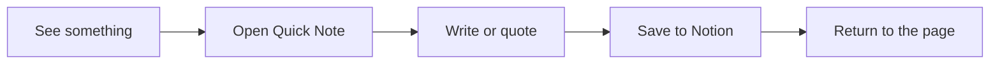
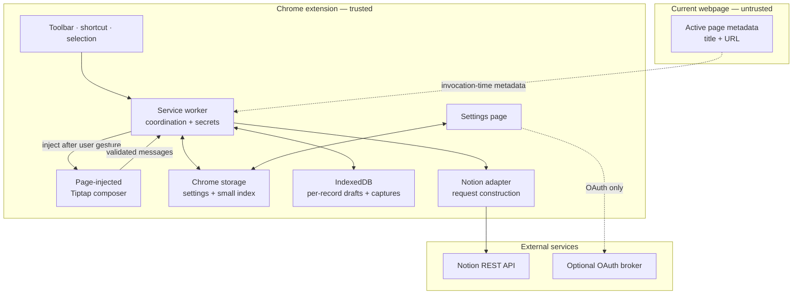
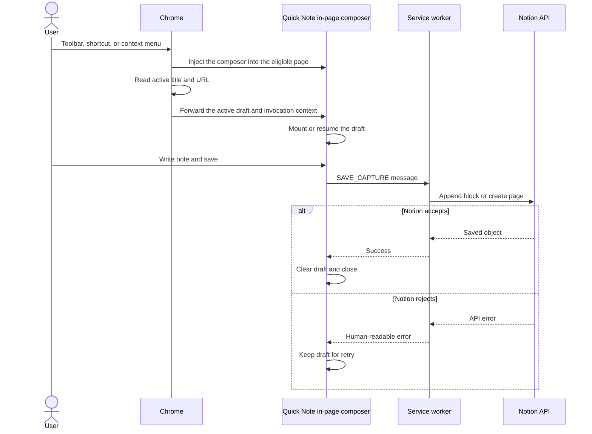
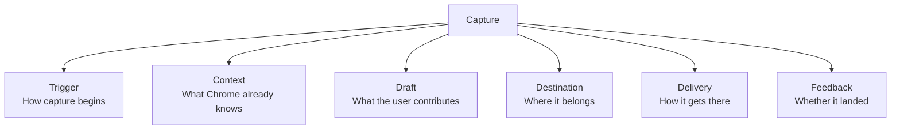
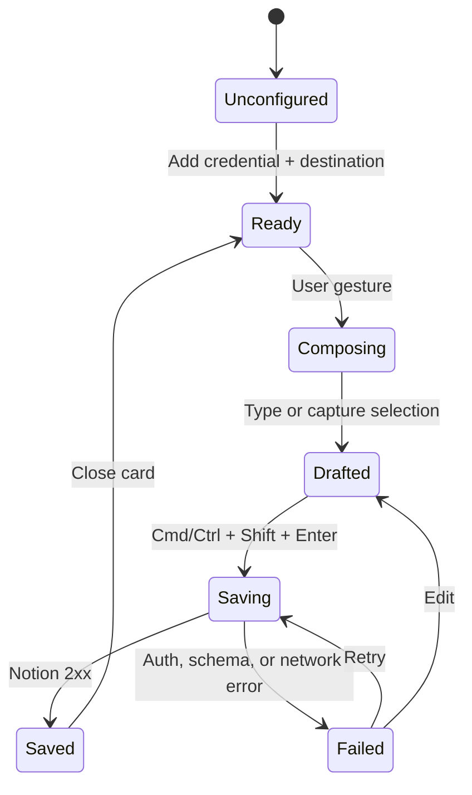
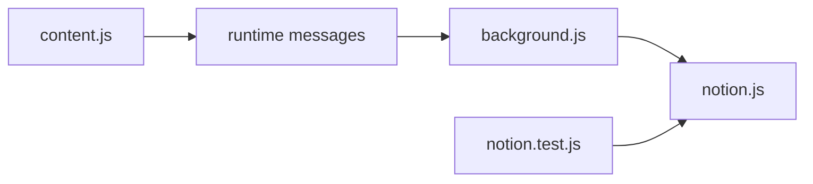
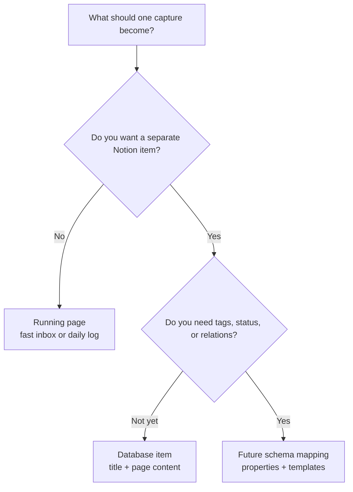
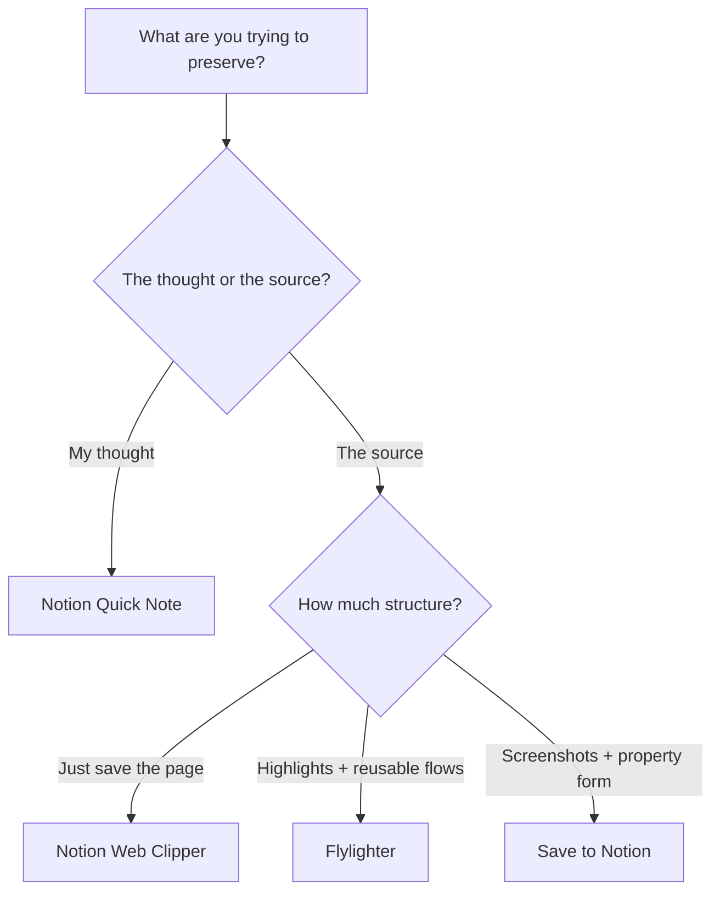
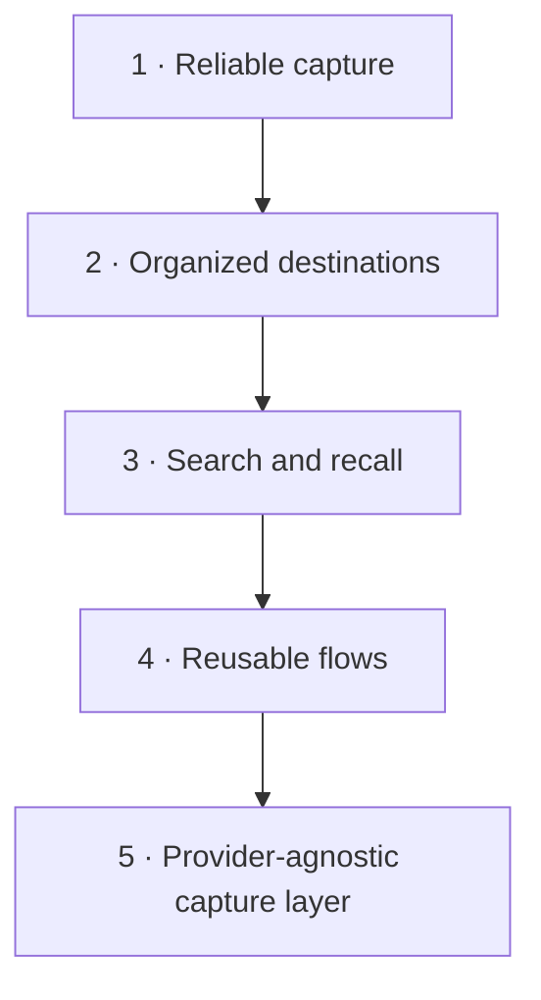
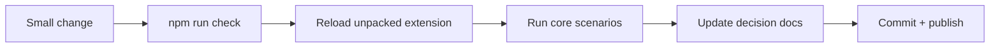

# Notion Quick Note: visual operating guide

This guide explains what the extension is, how its pieces cooperate, where to make changes, and how to grow it without losing the quiet simplicity that makes it useful.

For visual implementation decisions, use [`DESIGN.md`](../DESIGN.md) as the source of truth. The UI follows Notion's product system; references to Apple Quick Note in this guide describe invocation and capture behavior only.

## 1. The product in one picture

The product promise is not “save the whole web.” It is **capture the thought that the web caused, without breaking concentration**.

Apple's Quick Note establishes the interaction model: invoke it from a keyboard shortcut or the bottom-right corner while working in another app, optionally linking the current webpage. This extension applies that mental model to Chrome and uses Notion as the durable home. See [Apple's Quick Note guide](https://support.apple.com/guide/notes/create-a-quick-note-apdf028f7034/mac).

## 2. System architecture

### The most important boundary

The webpage gets a locally bundled composer only after the user invokes Quick Note, and it never receives the Notion token. The composer sends plain capture data to the service worker, where credentials and Notion transport remain isolated. The worker collects the invoking page's title, URL, and focused-frame selection once, before injection; a context-menu selection overrides the focused-frame selection.

## 3. The capture lifecycle

This sequence is the core contract. Future changes should preserve three qualities:

1. Opening is immediate.
2. A failed request never destroys the draft.
3. The user returns to the original page with minimal ceremony.

## 4. The product primitives

These are the reusable ideas beneath the current UI. Think in these terms before thinking in screens or buttons.

| Primitive | Current implementation | Useful future extensions |
|---|---|---|
| Trigger | Toolbar, browser shortcut, selection menu | Hot-corner companion, omnibox command |
| Context | URL, page title, selected text | Author, publish date, canonical URL, screenshot |
| Draft | Versioned Tiptap document with session persistence, Markdown rules, and slash commands | Templates, voice |
| Destination | Running page or database/data source | Multiple workspaces, routing rules, other providers |
| Delivery | Background message → Notion REST API | Offline queue, retry policy, idempotency |
| Feedback | Saving, saved, or error state | Capture history, undo, open-in-Notion action |

The best new features usually improve one primitive without entangling all the others. For example, adding screenshots should enrich **Context**, not require rewriting authentication or the composer lifecycle.

## 5. Runtime state model

This suggests the next reliability improvements naturally: validate configuration before entering `Ready`, distinguish authentication errors from schema errors, and add an offline state between `Saving` and `Failed`.

## 6. Where to edit what

| If you want to change… | Start here | Keep this contract intact |
|---|---|---|
| The floating card's layout, styling, copy, or keyboard behavior | `src/content.ts` | It must communicate through runtime messages and must not receive the token |
| Toolbar, shortcut, or context-menu behavior | `src/background.ts` | Opening must follow a user gesture; restricted pages show a temporary action error instead of another surface |
| What gets written into Notion | `src/notion.ts` | Keep request construction testable without Chrome APIs |
| Page-versus-database settings | `options/options.html`, `.css`, and `.ts` | Stored keys must remain compatible or be migrated |
| Manifest permissions or extension metadata | `manifest.json` | Request the smallest permission set possible |
| OAuth exchange behavior | `oauth-worker/src/index.ts` | Secrets stay server-side; redirects and origins remain allowlisted |
| Request-shape regression coverage | `tests/notion.test.ts` | Tests should remain Node-only and dependency-free where practical |
| Product intent and release gates | `docs/PRODUCT.md` | Update it when a decision changes, not just when code changes |

### Dependency direction

Keep the arrows pointing this way. In particular, `notion.js` should not import Chrome APIs or DOM code. That small separation is what makes the most important behavior easy to test.

## 7. Choosing the right destination

Start with a running page if capture speed matters more than organization. Use database mode when each note should have its own identity, URL, lifecycle, or searchable properties. Property mapping is intentionally not in the MVP because arbitrary Notion schemas create significant setup and validation complexity.

## 8. Position in the current landscape

This is a qualitative product comparison, not a claim that one tool is universally better.

| Option | Best at | Interaction center | Complexity | Ownership |
|---|---|---|---|---|
| **Notion Quick Note** | Capturing the thought caused by the current page | In-page composer | Low today | Fully user-owned and editable |
| **Notion Web Clipper** | Saving a webpage into a chosen Notion destination | One-click page clipper | Low | Official closed product |
| **Flylighter** | Multi-highlight research and configurable capture flows | Power-user editor/sidebar | High capability | Third-party product |
| **Save to Notion** | Rich web clipping, database fields, screenshots, and images | Configurable clip form | Medium–high | Third-party product |
| **Apple Quick Note** | OS-native, app-independent lightweight notes | Hot corner or `Fn/Globe + Q` | Very low | Apple Notes ecosystem |

Current public materials describe the [Notion Web Clipper](https://www.notion.com/web-clipper) as a one-click page-saving tool with destination selection and tagging. [Flylighter](https://docs.flylighter.com/) supports multiple highlights, formatted web elements, reusable flows, database properties, appending to earlier captures, and a multi-tab sidebar. [Save to Notion](https://www.savetonotion.so/) emphasizes web content, screenshots, images, and database-property forms.

### Which tool fits the moment?

The strategic whitespace is **thought-first capture with user-owned infrastructure**. Competing feature-for-feature with mature clippers would weaken that position and dramatically increase maintenance.

## 9. How value can compound

### Recommended order

1. **Reliable capture:** retry queue, clearer errors, configuration validation, OAuth refresh.
2. **Organized destinations:** destination picker, database schema discovery, property mapping.
3. **Recall:** recent captures, append to an earlier note, duplicate detection.
4. **Reusable flows:** presets for research, ideas, people, reading, and tasks.
5. **Capture layer:** Notion becomes one adapter among several, rather than the product's identity.

Do not start with multi-provider support. The abstraction will be much better after real usage reveals which parts of capture are genuinely shared.

## 10. Maintenance rhythm

### Core manual scenarios

Run these before every meaningful release:

- Open from toolbar and keyboard shortcut.
- Capture a plain note with and without a source link.
- Capture selected text with an empty note.
- Save to both a running page and a database.
- Confirm a failed request preserves the draft.
- Try a normal site, a strict/CSP-heavy site, and a restricted `chrome://` page.
- Check light mode, dark mode, keyboard-only use, and a narrow browser window.
- Reauthorize Notion and confirm previous tokens are handled correctly.

## 11. Lessons from building the MVP

### 1. The visual surface is not the security boundary

The card appears inside a webpage, but credential access belongs in the service worker. Maintaining that separation is more important than the exact rendering technology.

### 2. Authentication is a product layer, not a login button

A personal token makes local testing fast. A public extension needs OAuth, a protected client secret, token refresh, redirect validation, revocation, and clear workspace state. Treating those as separate stages prevented fake “production-ready” authentication.

### 3. Notion's database model is evolving

The current API distinguishes a database container from its data sources. The adapter resolves a pasted database URL to its first data source before creating a page. Keep API version changes isolated in `notion.js` and covered by request-shape tests.

### 4. Simplicity is a feature boundary

Flylighter and Save to Notion demonstrate how deep the clipping problem can become. Their sophistication is useful evidence, but not necessarily the MVP roadmap. Every configuration field added to the capture card increases the time between thought and capture.

### 5. Draft preservation creates trust

Users will tolerate an API error; they will not tolerate losing the thought. Local drafts and retry-safe behavior should remain first-class as delivery becomes more complex.

### 6. The browser is both the advantage and the constraint

The `activeTab` and `scripting` permissions let Quick Note collect the invoking page's title and URL and inject its locally bundled composer after an explicit user gesture. Chrome internal pages, browser PDF surfaces, the Web Store, inaccessible frames, and other unsupported targets do not create a draft or another composer surface; Quick Note shows a temporary action error instead.

## 12. The five takeaways to remember

1. **Protect the capture loop:** open, write, save, return.
2. **Think in primitives:** trigger, context, draft, destination, delivery, feedback.
3. **Keep secrets and Notion transport behind the service-worker boundary.**
4. **Win on thought-first simplicity before expanding into full web clipping.**
5. **Build reliability and recall before building more providers.**
